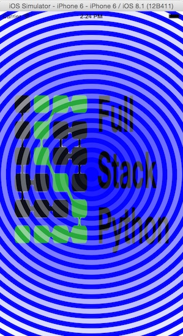

# Hypnosister
Demos the use of drawing in Swift. Built with XCode 6.1.1 and iOS SDK 8.1
at the 
[Big Nerd Ranch iOS Beginner's class](https://training.bignerdranch.com/classes/beginning-ios-iphone-ipad-with-swift).

The app produces a screenshot like the following:

